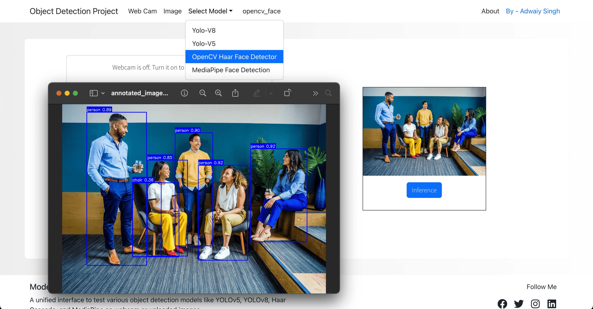
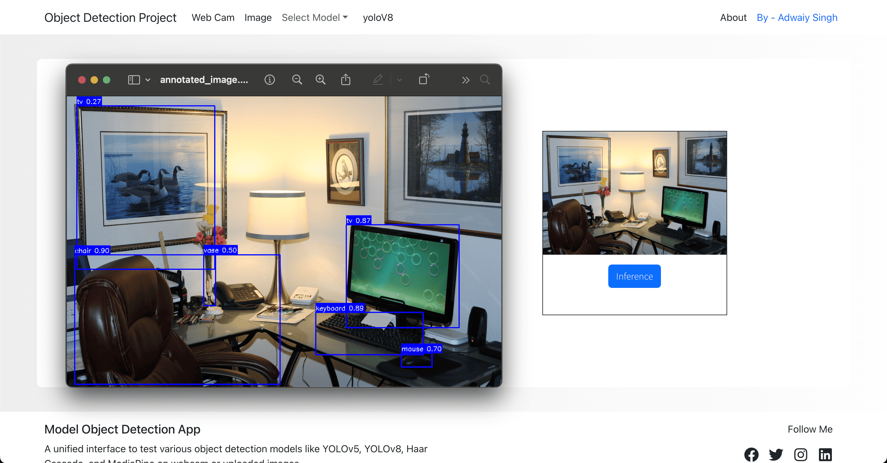

# Multi-Model Object Detection App

A web-based application for performing object detection using various models (YOLOv5, YOLOv8, OpenCV Haar Face Detection, and MediaPipe) on webcam and uploaded images. The interface is built with **React** and served via a **FastAPI** backend, offering flexibility in model selection and inference.

---

## 🚀 Features

-  🔄 Switch between multiple detection models in real time.
-  📸 Use webcam or upload an image for inference.
-  🧠 Backend supports YOLOv5, YOLOv8, OpenCV Haar, and MediaPipe.
-  🖼️ Download annotated images post inference.
-  🧰 Designed using Bootstrap for responsive layout.
-  💡 Live preview of selected model on the interface.

---

## 📁 Folder Structure

```
project/
│
├── FastAPI/
│   ├── main.py                 # FastAPI server
│   └── models/                 # Model loading logic (YOLO, Haar, etc.)
│
├── React/
│   ├── public/
│   └── src/
│       ├── components/
│       │   ├── Header.js
│       │   ├── Footer.js
│       │   ├── Home/Home.js
│       │   ├── Upload/Upload.js
│       │   └── Webcam/Webcam.js
│       ├── App.js
│       └── index.js
│
└── README.md
```

---

## 🧪 Models Supported

| Model            | Key for API   |
| ---------------- | ------------- |
| YOLOv8           | `yoloV8`      |
| YOLOv5           | `yoloV5`      |
| OpenCV Haar Face | `opencv_face` |
| MediaPipe Face   | `mediapipe`   |

Models are stored in the backend and initialized at startup. Default is YOLOv8.

---

## 🛠️ Setup & Run

### Backend (FastAPI)

```bash
cd FastAPI

python3 -m venv venv
source venv/bin/activate

pip install -r requirements.txt

uvicorn main:app --reload
```

### Frontend (React)

```bash
cd React

npm install
npm start
```

---

## 🌐 API Endpoint

`POST /annot/`

-  **Params**:
   -  `file`: image file
   -  `model`: model key from table above
-  **Response**: Annotated image as PNG

---

## 🧠 Powered By

-  [Ultralytics YOLO](https://github.com/ultralytics/ultralytics)
-  [OpenCV](https://opencv.org/)
-  [MediaPipe](https://mediapipe.dev/)
-  [FastAPI](https://fastapi.tiangolo.com/)
-  [React + Bootstrap](https://react-bootstrap.github.io/)

---

## 📸 Preview




